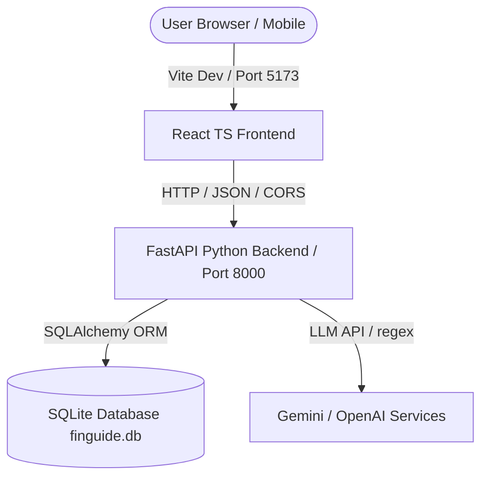

# FinGuide AI 🤖💼

> **Your Personal Multilingual Financial Co-Pilot**
> 
> *A simple, easy-to-use AI-powered financial assistant focused on financial inclusion.*

---

## 🌟 Overview

FinGuide AI is a hackathon-ready financial inclusion platform built to bridge the financial literacy gap. By supporting major local languages and providing simple interfaces, FinGuide AI helps students, workers, and families manage their money, track savings, simulate what-if scenarios, detect financial scams, and learn core banking concepts.

### Key Capabilities

1. **Multilingual Interface**: Support for English, Urdu (اردو), Roman Urdu, Punjabi (ਪੰਜਾਬੀ), Sindhi (سنڌي), Pashto (پښتو), Balochi (بلوچی), and Saraiki (سرائیکی).
2. **AI Financial Assistant**: Conversational co-pilot that extracts goals and intent dynamically from text or voice, falling back to a **Mock AI Engine** if API keys are not supplied.
3. **Smart Savings Goals & Price Tracking**: Recalculates saving targets and dates automatically. If a tracked product price hikes, it triggers visual alerts and options to realign your budget.
4. **Interactive What-If Simulator**: Slide savings rates or product markups to observe timelines shift.
5. **Heuristics Scam Detector**: Audits message texts for risk levels and details protective checklists.
6. **Financial Academy & Quizzes**: Simplified decks covering compound interest, inflation, etc., backed by interactive quizzes.

---

## 🏗️ Architecture



- **Frontend**: React (TypeScript), Vite, Tailwind CSS v4, Recharts, Lucide Icons.
- **Backend**: Python 3.10, FastAPI, SQLAlchemy ORM, SQLite database.
- **AI Integrations**: Google Gemini API / OpenAI GPT-4o-mini (with automated Mock AI Fallback).
- **Deployment**: Multi-container Docker Compose.

---

## 🚀 Installation & Setup

### Option 1: Running with Docker Compose (Recommended)

1. Ensure **Docker** and **Docker Compose** are installed and running.
2. Build and launch all services:
   ```bash
   docker-compose up --build
   ```
3. Open `http://localhost:5173` in your browser. The backend API is available at `http://localhost:8000`.

### Option 2: Local Manual Setup

#### Backend Setup
1. Navigate to the backend folder:
   ```bash
   cd backend
   ```
2. Create and activate a virtual environment:
   ```bash
   python -m venv venv
   # On Windows:
   .\venv\Scripts\activate
   # On macOS/Linux:
   source venv/bin/activate
   ```
3. Install dependencies:
   ```bash
   pip install -r requirements.txt
   ```
4. Start the FastAPI development server:
   ```bash
   uvicorn app.main:app --reload --port 8000
   ```

#### Frontend Setup
1. Navigate to the frontend folder:
   ```bash
   cd ../frontend
   ```
2. Install dependencies:
   ```bash
   npm install
   ```
3. Start the Vite server:
   ```bash
   npm run dev
   ```
4. Open the displayed URL (typically `http://localhost:5173`).

---

## ⚙️ Environment Variables

Copy the `.env.example` file to `.env` in the root:
```env
GEMINI_API_KEY=your_gemini_key_here
OPENAI_API_KEY=your_openai_key_here
```
*Note: If no API key is specified, the application automatically runs in **Mock AI Mode** with preset responses for common hackathon prompts. The demo will work perfectly out of the box!*

---

## 🎪 Hackathon Demo Flow (10 Steps)

Follow this exact flow to demo the prototype:

1. **Step 1: Open Landing Page**
   - Navigate to `http://localhost:5173`.
   - Click the prominent **"Try Demo"** button. This automatically logs you in as "Ali", pre-populates transactions, and sets up active goals.
2. **Step 2: Inspect Dashboard**
   - Confirm your **Financial Health score (78/100)** displays. Click **"Why?"** to read good/bad indicators.
   - Review your stats (PKR 100k Income, PKR 65k Expenses, PKR 35k Savings) and the category pie chart.
3. **Step 3: Talk to the AI Assistant**
   - Click **AI Assistant** in the sidebar.
   - Select or type: `"I want to buy a bike."`
   - The AI identifies the goal, extracts values, and presents an interactive **"Confirm & Create Goal"** action card.
4. **Step 4: Create a Savings Goal**
   - Click **"Confirm & Create Goal"** inside the chat bubble. It logs the goal and updates your active targets.
5. **Step 5: Go to Goals Page**
   - Click **Goals** in the sidebar.
   - You will see the **Honda CD 70** goal (Target: PKR 185k, Saved: PKR 80k, Progress: 43%, Estimated: April 2027).
6. **Step 6: Price Hikes Simulation**
   - On the right **Price Tracker** widget, click **"Simulate Price Change"** on Honda CD 70.
   - The price updates: `PKR 185,000 → PKR 200,000`.
7. **Step 7: Goal Adjustment Notification**
   - Look at the goal card. An alert warning appears: *"⚠️ Your goal price increased by PKR 15,000. New target: PKR 200,000. Estimated completion: May 2027."*
   - Test the options panel. Click **"Option 1"** (Raise monthly savings by PKR 2,500). Your savings rate updates, bringing the target date back.
8. **Step 8: Simulate What-If Timelines**
   - Click **Simulator** in the sidebar.
   - Drag the monthly savings slider from `15,000` to `20,000`.
   - Confirm the result card displays: *"You can reach your goal 4 months earlier!"*
9. **Step 9: Test Scam Detector**
   - Click **Scam Detector** in the sidebar.
   - Paste: `"Congratulations! You won PKR 500,000. Send PKR 2,000 processing fee to claim."`
   - Click **Check message** to see a **HIGH RISK (94/100)** score and safety checklists.
10. **Step 10: Multilingual Mode**
    - Go to **Settings** and change Language to **Urdu** or **Roman Urdu**.
    - Navigate back to **AI Assistant** and type: `"Mujhe batao main apna goal jaldi kaise pura kar sakta hoon?"` (or speech-to-text input via the microphone button).
    - FinGuide AI automatically detects the input language and answers in Urdu/Roman Urdu.

---

## 🛡️ Educational Disclaimer
FinGuide AI is built as an educational prototyping platform. It does not store real bank accounts or act as a registered financial advisor.
