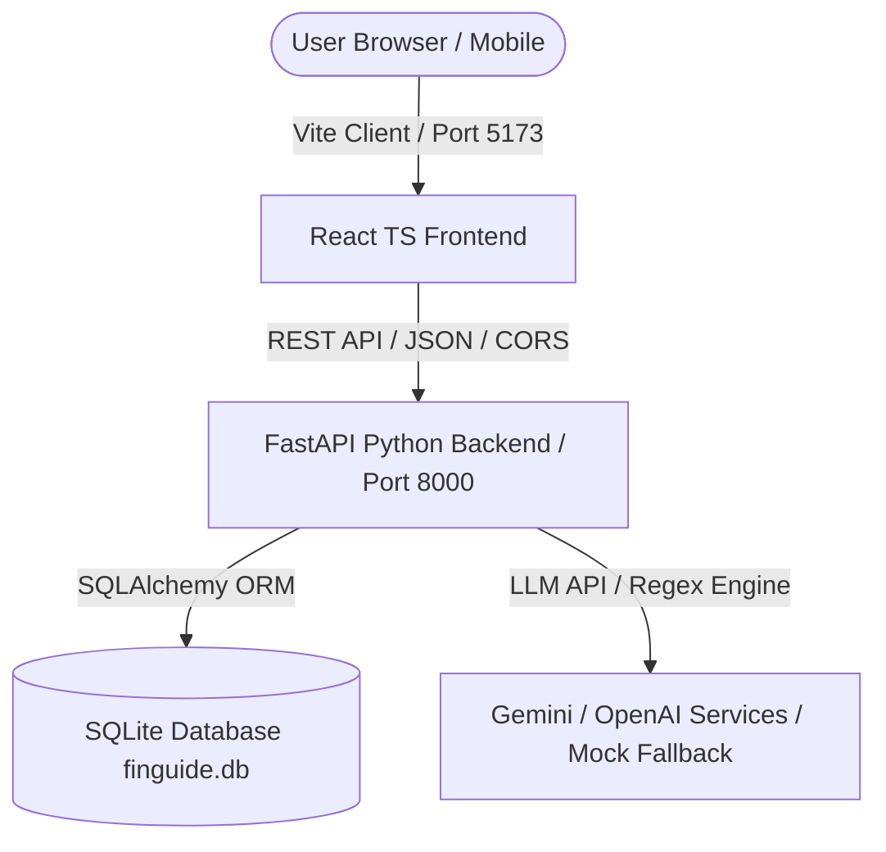

# FinGuide AI 🤖💼

> **Your Personal Multilingual Financial Co-Pilot**
> 
> *A simple, intuitive, AI-powered financial companion built for financial literacy and inclusion.*

---

## 🌟 Overview

FinGuide AI is a financial inclusion platform designed to bridge the financial literacy gap across Pakistan and underserved communities. By supporting 8 regional and national languages with full right-to-left (RTL) localization and accessible conversational interfaces, FinGuide AI empowers users to understand their money, manage budgets, track savings goals, scan receipts, and stay protected from digital fraud.

### 🌐 Complete Multilingual Support (8 Languages)

FinGuide AI provides native script and dynamic translation across every page:

| Code | Language | Native Script | Layout Direction |
| :--- | :--- | :--- | :--- |
| `en` | **English** | English | LTR |
| `ur` | **Urdu** | اردو | RTL |
| `roman_urdu` | **Roman Urdu** | Roman Urdu | LTR |
| `pa` | **Punjabi** | پنجابی / ਪੰਜਾਬੀ | RTL / LTR |
| `sd` | **Sindhi** | سنڌي | RTL |
| `ps` | **Pashto** | پښتو | RTL |
| `bal` | **Balochi** | بلوچی | RTL |
| `skr` | **Saraiki** | سرائیکی | RTL |

- **Instant Language Switching**: Switch languages on the fly from the Landing Page, Login Screen, Registration Flow, or Dashboard Header/Sidebar.
- **RTL & Typography**: Automatic `dir="rtl"` layout flipping with curated Nastaliq typography (`Noto Nastaliq Urdu`, `Jameel Noori Nastaleeq`) for Arabic-script languages.
- **Persistent Preferences**: User language selection persists across sessions in `localStorage` and syncs with user profile settings.

---

### 🔑 Key Features

1. **AI Financial Co-Pilot**:
   - Conversational assistant supporting natural language queries in Urdu, Roman Urdu, English, Punjabi, etc.
   - Extracts financial goals, expense intents, and budget questions automatically.
   - Fallback to an offline **Mock AI Engine** when external API keys are unavailable.

2. **Money Manager & Expense Tracking**:
   - Comprehensive income and expense transaction logger with custom categorizations.
   - Live aggregated summary cards: **Total Income**, **Total Expenses**, and **Net Balance**.
   - Filter by date, category, or transaction type.

3. **Receipt Scanner**:
   - Optical and simulated receipt parsing that extracts amounts, dates, and vendor details into instant transaction entries.

4. **Smart Savings Goals & Market Price Tracking**:
   - Goal tracking with automated price hike simulations (e.g. inflation adjustments on vehicles or electronics).
   - Dynamic recalculation of target completion dates and guided recommendations to adjust monthly contributions.

5. **Heuristic Scam Detector**:
   - Risk assessment engine for SMS, WhatsApp messages, or emails claiming prizes or lottery winnings.
   - Generates risk scores (0–100) and actionable safety tips.

6. **Reports & Analytics**:
   - Visual spending breakdowns with interactive charts powered by Recharts.

---

## 🏗️ System Architecture



- **Frontend**: React 18, TypeScript, Vite, Tailwind CSS, Lucide React, Recharts.
- **Backend**: Python 3.10+, FastAPI, SQLAlchemy ORM, SQLite, Pydantic.
- **AI Integrations**: Google Gemini API & OpenAI GPT-4o-mini (with automated mock fallback).
- **Styling & RTL**: Tailored CSS design system with CSS custom properties and RTL rules.

---

## 🚀 Getting Started

### Prerequisites
- **Python 3.10+**
- **Node.js 18+** & **npm**
- *(Optional)* **Docker** & **Docker Compose**

---

### Option 1: Running Locally (Recommended for Development)

#### 1. Start the Backend Server
```bash
# Navigate to backend directory
cd backend

# Create and activate virtual environment
# Windows:
python -m venv venv
.\venv\Scripts\activate

# macOS / Linux:
python3 -m venv venv
source venv/bin/activate

# Install requirements
pip install -r requirements.txt

# Start FastAPI development server
python -m uvicorn app.main:app --reload --port 8000
```
> The API will be available at: `http://localhost:8000`  
> Interactive Swagger Documentation: `http://localhost:8000/docs`

#### 2. Start the Frontend Server
Open a new terminal tab/window:
```bash
# Navigate to frontend directory
cd frontend

# Install npm dependencies
npm install

# Run Vite dev server
npm run dev
```
> The application will be running at: `http://localhost:5173`

---

### Option 2: Running with Docker Compose

```bash
docker-compose up --build
```
Open `http://localhost:5173` in your browser.

---

## ⚙️ Configuration & Environment Variables

Create a `.env` file in the root directory if you want to use live LLM APIs:
```env
# Optional - if omitted, FinGuide runs in Mock AI mode seamlessly
GEMINI_API_KEY=your_gemini_api_key_here
OPENAI_API_KEY=your_openai_api_key_here
```

---

## 🎪 Quick Walkthrough & Demo Guide

1. **Landing Page**:
   - Open `http://localhost:5173`.
   - Test the **Language Dropdown** in the navbar or circular selector. Switch between English, Urdu, Roman Urdu, Punjabi, Sindhi, Pashto, Balochi, or Saraiki and observe instant full-page translation and RTL adaptation.
   - Click **"Try Demo"** to log into the pre-populated demo account.

2. **Dashboard**:
   - Inspect financial overview metrics, recent transactions, and category spending charts.
   - Check the Financial Health Score and indicator explanations.

3. **Money Manager**:
   - View accurate **Total Income**, **Total Expenses**, and **Net Balance**.
   - Add new income or expense items and verify immediate balance recalculations.

4. **AI Assistant**:
   - Ask financial questions in English, Urdu, or Roman Urdu (`"Mujhe budget banane mein madad chahiye"`).
   - Type `"I want to save for a laptop"` to see automated goal extraction.

5. **Price Hike Simulation (Goals Page)**:
   - Go to **Goals** and click **"Simulate Price Change"** on an active goal to watch the dynamic recalculation and adjustment banner appear.

6. **Scam Detector**:
   - Paste suspicious messages into the detector to receive instant risk ratings and protective checklists.

---

## 🛡️ Educational Disclaimer
FinGuide AI is developed as an educational and financial literacy platform. It does not provide certified financial advice or store sensitive banking credentials.

---

## 📄 License
Built for financial inclusion and digital accessibility. © 2026 FinGuide AI. All rights reserved.
